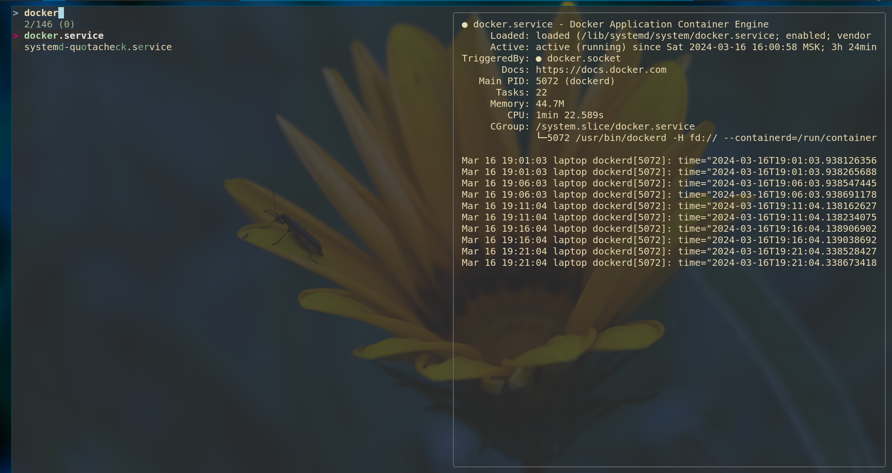
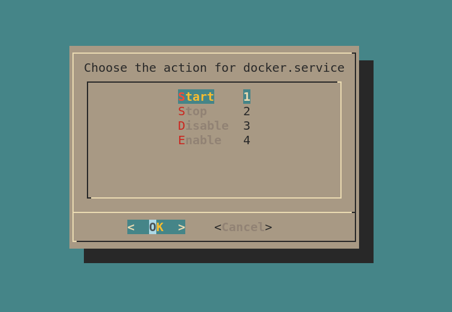
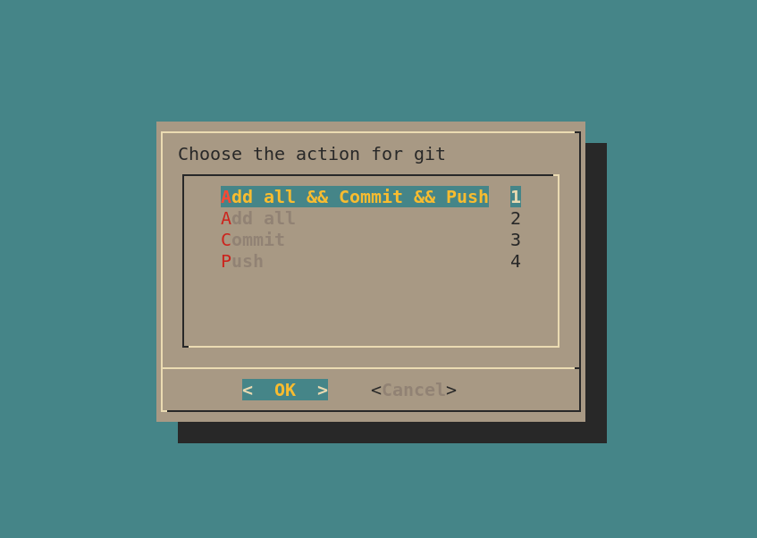
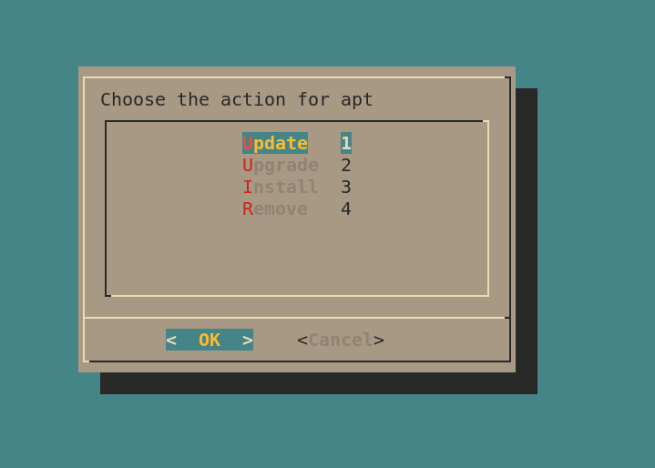
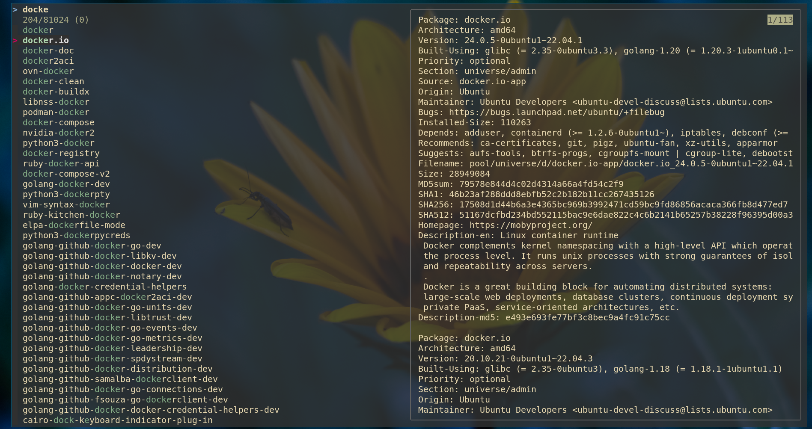
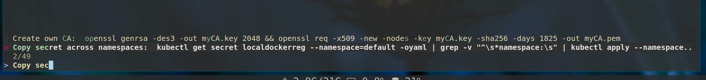

# GUI scripts
## Description
GUI scripts for popular cli tools, based on dialog and fzf

## Scripts
- `a` - for managing apt packages
- `g` - for managing git repo
- `s` - for managing systemd services
- `r` - for running named commands from ~/.aliases.txt file
- `e` - open `lf` file manager
- `lk` - listen for keys above (except `r`)

See [Screenshots](#screenshots) section

## Installation
### Ubuntu/Debian-based
Download .deb package from [Releases](https://git.digitalstudium.com/digitalstudium/run/releases), then install it
```
sudo apt install ~/Downloads/gui-scripts_*.deb
```
### Other linux distros
Install dependencies: `fzf`, `dialog`, `xdotool`, `x11-xkb-utils`

Then clone this repo and copy all scripts to one of the PATH folder:
```
git clone https://git.digitalstudium.com/digitalstudium/gui-scripts.git
sudo cp gui-scripts/{a,g,s,r} /usr/local/bin/
```

## Screenshots
### s


### g


### a


### r

